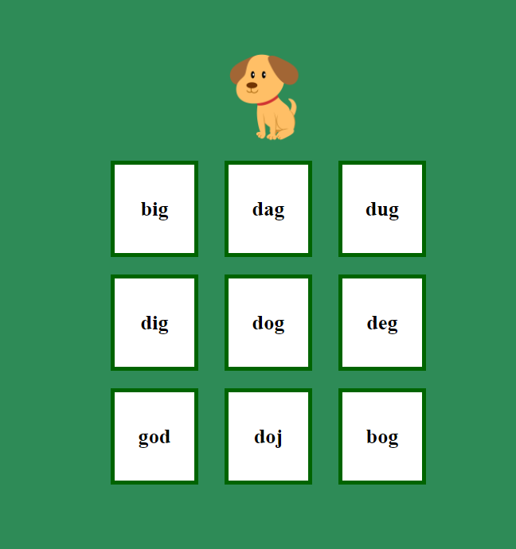
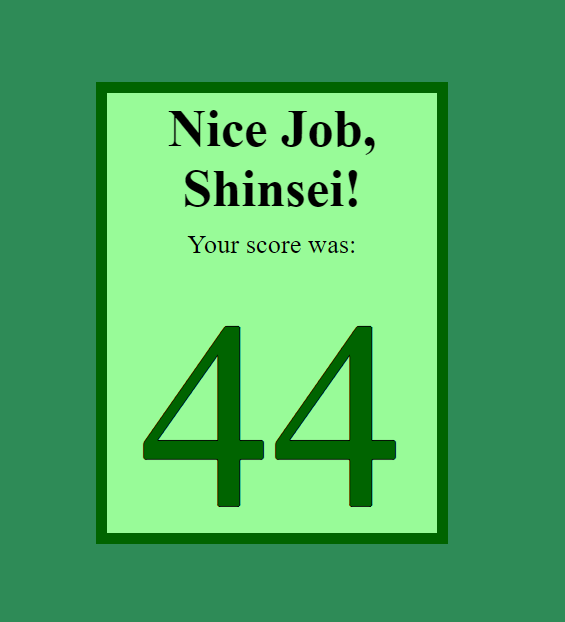

# Spelling Game

A simple spelling game created for my 3 year old son with Vue 3.0
<table align="center">
  <thead>
    <tr>
      <th colspan="2">Technologies</th>
    </tr>
  </thead>
  <tbody>
    <tr>
      <td>Languages</td>
      <td>
        
      </td>
    </tr>
    <tr>
      <td>Front-End</td>
      <td>
        
        
        
        
      </td>
    </tr>
  </tbody>
</table>

## Project Status

The first iteration of the game is finished and playable all the way through. By clicking on "Go", the player gets to choose which of the nine words to start with. From there, the order of words to spell is randomized. With each correct guess the player is taken to the next spelling word and is given five points. Each wrong guess subtracts one point. At the end of the game (i.e. when a player has correctly spelled all nine words), the player is shown the GameOver component which shows the final score. 

All data is imported from `src/data.json`, so new words are simple to add.

### Next Steps

- Options to limit the number of available spelling options from nine to six or three

- Additional words corresponding to different difficulty levels

- User feedback for correct answers

- Hosting so the app doesn't need to be run locally

## Instillation and setup instructions
Fork, clone, and then

- To install dependancies:

    `npm install`

- To compile the Vue SPA using Vite:

    `npm run dev`

## Reflection

Stay tuned!

